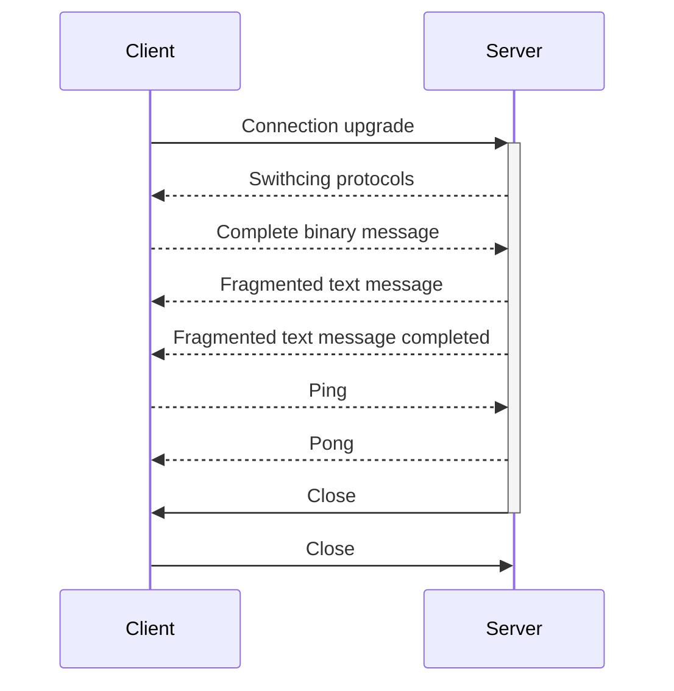

# Websockets

## General
Websockets are a protocol build on top of TCP. It has nothing to do with HTTP with one exception: the handshake.

The handshake to establish a Websocket connection is the same as HTTP GET request with headers and everything, 
so it's protocol `Upgrade` header can be interpreted by http servers and/or proxies.

Instead of the http/https URI protocol, ws/wss protocol is used.
Just like `http` is unsecured and by default running on port 80, so is `ws` unsecured and running on port 80 by default.
Similarly both `https` and `wss` is usually running on port 443 in a TLS tunnel.

Websockets are initiated by an HTTP GET request like so:
```
GET /endpoint HTTP/1.1
Host: server.example.com
Upgrade: websocket
Connection: Upgrade
Sec-WebSocket-Key: dGhlIHNhbXBsZSBub25jZQ==
Sec-WebSocket-Version: 13
Origin: http://example.com
```

`Sec-WebSocket-Key` is a random base64 encoded 16byte client generated value.
`Sec-WebSocket-Version` has to always be present with a value of `13`
`Connection` also has to be present, and it's value has to contain `Upgrade`. Though the letter casing doesn't matter.
`Upgrade` header must be present as well and one of it's values has to be `websocket`.
The `Origin` header must be present if the request comes from a browser. For other clients it's optional.
Other headers might be present as well, as well as cookies. But those are optional.

The server then responds with 101 status code and some mandatory and some optional headers.
```
HTTP/1.1 101 Switching Protocols
Upgrade: websocket
Connection: Upgrade
Sec-WebSocket-Accept: s3pPLMBiTxaQ9kYGzzhZRbK+xOo=
```
The `Upgrade` and `Connection` headers must be present. They will generally have the same value the client used.
`Sec-WebSocket-Accept` is a response to the `Sec-WebSocket-Key` from the client. It's value is calculated like so:
`base64(SHA1(<Sec-WebSocket-Key> + "258EAFA5-E914-47DA-95CA-C5AB0DC85B11"))`.
By sending this value, the server indicates that it willingly accepts the websocket connection instead of it being just some static service responding with the same value every time.

If any of the mandatory headers is missing, the status code is not 101 or the  `Sec-WebSocket-Accept` is not correct, the websocket connection won't be established and the TCP connection will close.

If everything is OK the TCP connection will NOT be closed.

Note: The websocket specification doesn't mention anything about TLS requirements, however it is normally not possible,
to connect to a websocket endpoint without a TLS connection in a browser outside of secure context.
Secure context, according to browsers, is either `localhost` hostname or an `127.0.0.1/24` and `::1` IP addresses.

## Frames

Just like TCP communicates using packets, websockets communicate using frames. The whole message doesn't have to fit withing one frame and may be split into fragments.
A Frame is a message containing:
- a bit indicating whether this is the last fragment for the particular message.
- 3 bits reserved for an extension of websockets.
- 4 bits specifying what kind of message this is. It's called OPCODE. It's values can be one of:
- - 0x0 - this is a continuation of previous fragment
- - 0x1 - this will be a text message (using UTF-8)
- - 0x2 - this will be a binary message
- - 0x3 - 0x7 - reserved
- - 0x8 - the sender wants to close the channel
- - 0x9 - a ping message
- - 0xA - a pong message - it's a response to a ping message
- - 0xB - 0xF - reserved for future use
- 1 bit indicating whether the actual data will be masked or not
- 7 or 7+16 or 7+64 bits. Here's the size of the actual data in this frame is stored.
- 32bit mask if the masking bit is set
- Size based on the size bits earlier. Contains the actual message data.



## Protocols for websockets
### STOMP
Probably the most used protocol. By default in spring. Searching for websockets in spring will mostly result in articles where they're using STOMP.
A Simple plain text protocol.


## Websockets in spring
Spring by default support 3 approaches to websockets.
1) easy to understand, easy to setup, hard to manage. WebSocketConfigurer
2) hard to understand, easy to setup, managed basically automagically. WebSocketMessageBrokerConfigurer
3) requires external system, hard to setup, otherwise same as above.

### No. 1
See demo

### No. 2
See demo

### No. 3
Question time. 

---

Q: What disadvantage do the above methods have?

A: It is centralized. Every app instance can only send messages to clients that connected to it. 

---

Q: How do we fix it?

A: Message brokers. Kafka, RabbitMq, etc.

---

Ok, how it works?

- User A, connected to Server A posts a message into a topic on said server.
- Server A takes the message and puts it into a topic in message broker.
- Message broker notifies all subscribed servers about new message.
- Server A and Server B both consume this event and send a message using websockets to clients that has a connection with them and are subscribed to the topic.

```mermaid
TODO: draw it
```

## Security
Since the Websocket handshake is just a standard GET method and support all various headers, it also supports many of AuthN and AuthZ approaches.
The problem with this is, that this validation only happens once - at the websocket creation.

## RFCs
- [The WebSocket Protocol](https://datatracker.ietf.org/doc/html/rfc6455)